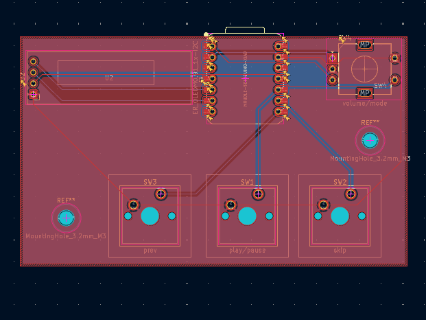
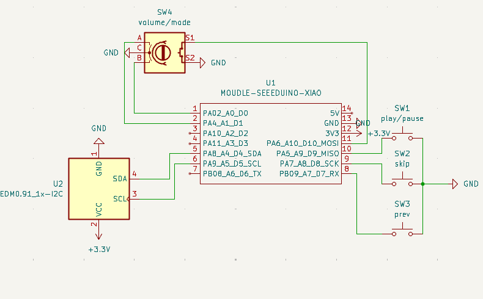
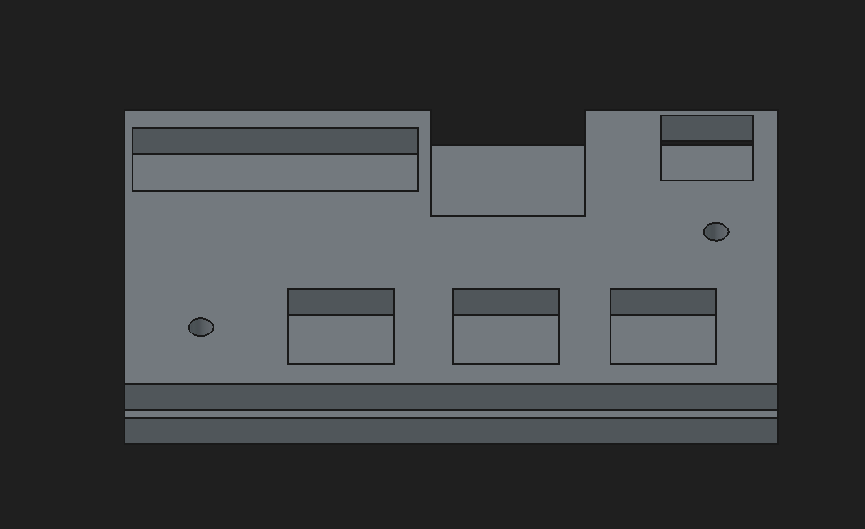
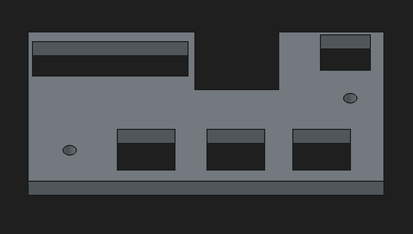
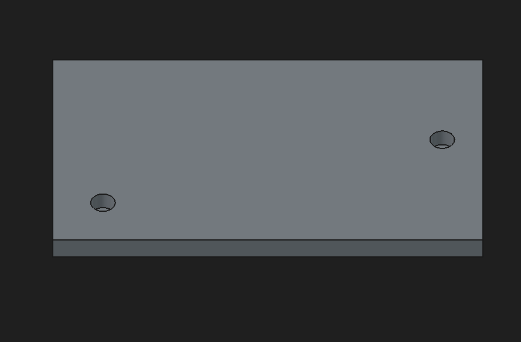

# SoundPad

This is a 3 (+1 if you count the rotary encoder) button keypad with media controls and hotkeys (as the F+12 keys) for other apps. The 128x32 OLED screen also displays the current mode (MEDIA-OTHER).

# PCB and Schematic

# Case (The PCB is a layer, between the two parts)

Whole

Top

Bottom

# Firmware
The firmware was written in KMK
- The rotary encoder changes volume, pressing it changes the mode of the keys
- The buttons are: Mode 1 (MEDIA) Previous Track - Play/Pause - Skip track; Mode 2 (OTHER) F13-15

# BOM
2x M3x5mx4mm heatset inserts
2x M316 screws
3x Cherry-MX switxhes with DSA keycaps
1x EC11 rotary encoder
1x 0.91 inch OLED
1x 2 part case (3D printed)